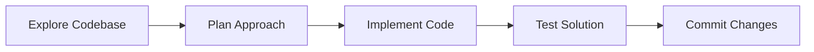
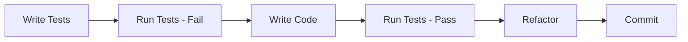

# Claude Code Best Practices - Student Handout

## Quick Start Guide

### Installation
```bash
# Install Claude Code CLI
npm install -g @anthropic/claude-code

# Or use with npx
npx @anthropic/claude-code
```

### Basic Commands
```bash
claude code              # Start interactive session
claude code --help       # Show help
/help                   # Get help within session
/permissions            # Manage tool permissions
/exit                   # Exit session
```

---

## Core Concept 1: CLAUDE.md Files

### What is CLAUDE.md?
A markdown file that provides persistent context and instructions to Claude Code about your project or preferences.

### Where to Place CLAUDE.md

| Location | Purpose | Example Content |
|----------|---------|-----------------|
| Project root | Project-specific context | Build commands, test scripts, coding standards |
| `~/.claude/` | Global preferences | Personal aliases, common patterns |

### Essential CLAUDE.md Template

```markdown
# Project: [Your Project Name]

## Quick Commands
- Build: npm run build
- Test: npm test
- Lint: npm run lint
- Deploy: npm run deploy

## Project Structure
- /src - Source code
- /tests - Test files
- /docs - Documentation
- /config - Configuration files

## Coding Standards
- Use TypeScript
- Follow ESLint rules
- Write tests for new features
- Comment complex logic

## Environment Setup
- Node version: 18+
- Required: Docker, PostgreSQL
- ENV vars in .env.example

## Known Issues
- Hot reload may fail on Windows
- Use npm, not yarn
```

---

## Core Concept 2: Managing Permissions

### Permission Strategies

#### 1. Interactive (Safest)
- Claude asks for each new command
- Choose "Always allow" for trusted commands

#### 2. Predefined Whitelist
```json
// .claude/settings.json
{
  "allowedTools": [
    "Bash:npm install",
    "Bash:npm run build",
    "Bash:npm test",
    "Read:*",
    "Write:src/**"
  ]
}
```

#### 3. Command Line Flags
```bash
claude code --allowedTools "Bash:npm install,Bash:npm test"
```

#### 4. YOLO Mode (⚠️ Dangerous)
```bash
claude code --dangerously-skip-permissions
```

### Security Best Practices
- ✅ Whitelist specific commands
- ✅ Review permissions regularly
- ✅ Use project-specific settings
- ❌ Never use YOLO mode in production
- ❌ Don't allow unrestricted bash access

---

## Core Concept 3: Effective Workflows

### Workflow 1: Explore → Plan → Code → Commit



#### Example Commands:
```
1. "Show me how authentication works in this project"
2. "Let's plan how to add OAuth support"
3. "Implement Google OAuth integration"
4. "Run the tests and fix any issues"
5. "Create a commit with these changes"
```

### Workflow 2: Test-Driven Development (TDD)



#### Example Commands:
```
1. "Write tests for a user registration service"
2. "Run the tests to confirm they fail"
3. "Now implement the registration service"
4. "Run tests again to verify they pass"
5. "Refactor for better performance"
```

### Workflow 3: Visual Implementation

1. Provide design mock (screenshot/image)
2. Request implementation
3. Take screenshot of result
4. Iterate on feedback
5. Finalize when matching

---

## Core Concept 4: Extending Capabilities

### Model Context Protocol (MCP)

#### Adding MCP Servers
```bash
# Add globally
claude code mcp add /path/to/mcp-server

# Or configure in project
```

#### Project Configuration (.mcp.json)
```json
{
  "servers": {
    "database": {
      "command": "node",
      "args": ["./mcp-servers/database.js"]
    },
    "analytics": {
      "command": "python",
      "args": ["./mcp-servers/analytics.py"]
    }
  }
}
```

### Custom Slash Commands

#### Creating Commands
```bash
# Create command file
echo 'Generate unit tests for: $ARGUMENTS' \
  > ~/.claude/commands/generate-tests

# Use in session
/generate-tests userService.js
```

#### Useful Command Templates
```bash
# Code review
echo 'Review this code for bugs and improvements: $ARGUMENTS' \
  > ~/.claude/commands/review

# Documentation
echo 'Generate documentation for: $ARGUMENTS' \
  > ~/.claude/commands/document

# Refactor
echo 'Refactor for better performance: $ARGUMENTS' \
  > ~/.claude/commands/optimize
```

---

## Practical Tips

### 1. Providing Context

#### ❌ Poor Context
```
"Fix the bug"
"Make it better"
"It doesn't work"
```

#### ✅ Good Context
```
"Fix the login bug where users can't sign in with Google OAuth"
"Improve performance of the data fetching in dashboard.js"
"The API returns 404 when accessing /users endpoint with valid token"
```

### 2. File Operations

#### Efficient File Navigation
```
# Instead of: "Show me all files"
"Show me files related to authentication"
"Find the user model definition"
"Search for OAuth configuration"
```

#### Batch Operations
```
# Good: Single request with multiple tasks
"Update all test files to use the new API endpoint"

# Less efficient: Multiple separate requests
"Update test1.js"
"Update test2.js"
"Update test3.js"
```

### 3. Debugging with Claude

#### Effective Bug Reports
1. Include full error message
2. Provide stack trace
3. Mention recent changes
4. Specify environment (dev/prod)
5. Include relevant logs

#### Example:
```
"I'm getting 'TypeError: Cannot read property 'id' of undefined' 
in userProfile.js line 45 when clicking the profile button. 
This started after merging the auth refactor PR.
Stack trace: [paste trace]
Console shows 401 error before the TypeError."
```

---

## Common Patterns

### Pattern 1: Incremental Development
```
1. "Create a basic user model"
2. "Add validation to the user model"
3. "Add authentication methods"
4. "Write tests for the user model"
5. "Add documentation"
```

### Pattern 2: Code Review Cycle
```
1. "Implement feature X"
2. "Review the implementation for issues"
3. "Apply the suggested improvements"
4. "Add tests for edge cases"
5. "Create a PR-ready commit"
```

### Pattern 3: Refactoring Session
```
1. "Analyze this module for improvements"
2. "Suggest refactoring approach"
3. "Implement the refactoring"
4. "Ensure tests still pass"
5. "Document the changes"
```

---

## Troubleshooting Guide

### Issue: Claude doesn't understand project structure
**Solution:** Create/update CLAUDE.md with project layout

### Issue: Repetitive permission requests
**Solution:** Add common commands to allowedTools in settings

### Issue: Claude suggests wrong coding style
**Solution:** Document style guide in CLAUDE.md

### Issue: Tests failing after Claude's changes
**Solution:** Ask Claude to run tests and fix issues before committing

### Issue: Claude using wrong package manager
**Solution:** Specify in CLAUDE.md (e.g., "Use npm, not yarn")

---

## GitHub Integration

### Setup GitHub CLI
```bash
# Install
brew install gh  # macOS
sudo apt install gh  # Linux

# Authenticate
gh auth login

# Verify
gh auth status
```

### Common GitHub Operations
```
# Create PR
"Create a pull request for this feature"

# Review PR
"Show me comments on PR #123"

# Create issue
"Create an issue for the bug we just found"

# Check CI status
"Check if the CI tests are passing"
```

---

## Best Practices Checklist

### Before Starting a Session
- [ ] CLAUDE.md is up to date
- [ ] Permissions are configured
- [ ] Working directory is correct
- [ ] Git branch is appropriate

### During Development
- [ ] Provide clear, specific instructions
- [ ] Test changes before committing
- [ ] Follow project conventions
- [ ] Document significant changes

### After Session
- [ ] Review generated code
- [ ] Run final test suite
- [ ] Update documentation if needed
- [ ] Commit with meaningful message

---

## Keyboard Shortcuts

| Shortcut | Action |
|----------|--------|
| `Ctrl+C` | Cancel current operation |
| `Ctrl+D` | Exit session |
| `Tab` | Autocomplete commands |
| `↑/↓` | Navigate command history |

---

## Resources and Links

### Official Documentation
- [Claude Code Documentation](https://docs.anthropic.com/en/docs/claude-code)
- [MCP Protocol Spec](https://modelcontextprotocol.org)
- [GitHub CLI Documentation](https://cli.github.com/manual/)

### Community Resources
- GitHub Issues: Report bugs and request features
- Discord: Join the Claude community
- Blog: Latest tips and updates

### Learning Path
1. Start with basic file operations
2. Set up CLAUDE.md for your project
3. Configure permissions
4. Try TDD workflow
5. Explore MCP servers
6. Create custom commands

---

## Notes Section

Use this space to record your own tips, tricks, and learnings:

```
_____________________________________________
_____________________________________________
_____________________________________________
_____________________________________________
_____________________________________________
_____________________________________________
_____________________________________________
_____________________________________________
_____________________________________________
_____________________________________________
```